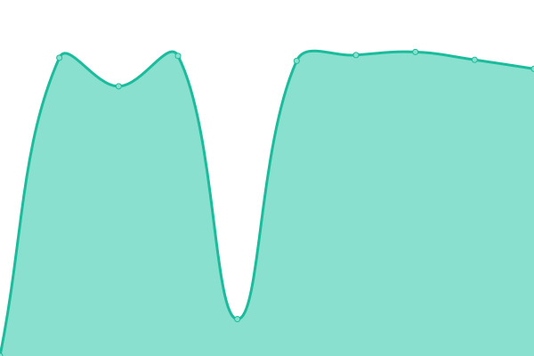

# [📈 Live Status](https://status.testronaut.app): <!--live status--> **🟩 All systems operational**

This repository contains the open-source uptime monitor and status page for [Shane Fast](https://status.testronaut.app), powered by [Upptime](https://github.com/upptime/upptime).

With [Upptime](https://upptime.js.org), you can get your own unlimited and free uptime monitor and status page, powered entirely by a GitHub repository. We use [Issues](https://github.com/scfast/testronaut-status/issues) as incident reports, [Actions](https://github.com/scfast/testronaut-status/actions) as uptime monitors, and [Pages](https://status.testronaut.app) for the status page.

<!--start: status pages-->
<!-- This summary is generated by Upptime (https://github.com/upptime/upptime) -->
<!-- Do not edit this manually, your changes will be overwritten -->
<!-- prettier-ignore -->
| URL | Status | History | Response Time | Uptime |
| --- | ------ | ------- | ------------- | ------ |
|  [App](https://mission.testronaut.app/api/health) | 🟩 Up | [app.yml](https://github.com/mission-testronaut/testronaut-status/commits/HEAD/history/app.yml) | 

 1804ms
     
 | 

<a href="https://status.testronaut.app/history/app">100.00%</a>
    

|  [API](https://api.testronaut.app/api/health) | 🟩 Up | [api.yml](https://github.com/mission-testronaut/testronaut-status/commits/HEAD/history/api.yml) | 

 1772ms
     
 | 

<a href="https://status.testronaut.app/history/api">100.00%</a>
    

|  [Site](https://testronaut.app) | 🟩 Up | [site.yml](https://github.com/mission-testronaut/testronaut-status/commits/HEAD/history/site.yml) | 

 199ms
     
 | 

<a href="https://status.testronaut.app/history/site">100.00%</a>
    

|  [Docs](https://docs.testronaut.app) | 🟩 Up | [docs.yml](https://github.com/mission-testronaut/testronaut-status/commits/HEAD/history/docs.yml) | 

 379ms
     
 | 

<a href="https://status.testronaut.app/history/docs">100.00%</a>
    

|  [Demo](https://demo.testronaut.app/) | 🟩 Up | [demo.yml](https://github.com/mission-testronaut/testronaut-status/commits/HEAD/history/demo.yml) | 

 303ms
     
 | 

<a href="https://status.testronaut.app/history/demo">100.00%</a>
    

<!--end: status pages-->

[**Visit our status website →**](https://status.testronaut.app)

## 📄 License

- Powered by: [Upptime](https://github.com/upptime/upptime)
- Code: [MIT](./LICENSE) © [Anand Chowdhary](https://anandchowdhary.com), supported by [Pabio](https://pabio.com)
- Data in the `./history` directory: [Open Database License](https://opendatacommons.org/licenses/odbl/1-0/)
